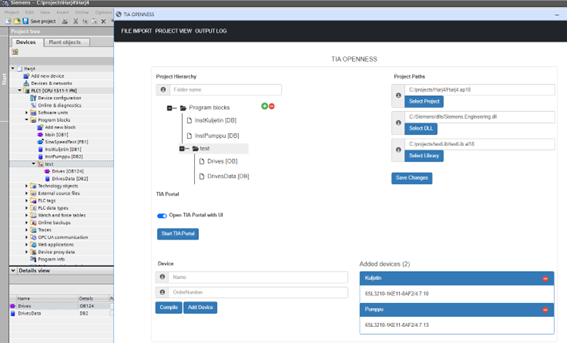

# tiaportal-app

Sovelluksen käyttöohjeet
Dokumentti sisältää ohjeet TIA Openness sovelluksen käyttöön. Tarjoaa ohjeet sovelluksen asentamiseen, sivujen toimintoihin, uuden laitteen luomiseen, laitelistan hallintaan ja projektipuun käyttöön.

Asennus
-	Tuo projekti GitHubista.
-	Asenna python https://www.python.org/downloads/
-	Suorita asennustiedosto.
-	Käynnistä sovellus klikkaamalla app.pyw

Sovelluksen valikot
-	Sovelluksessa voi navigoida eri sivujen välillä kuten "File Import", "Pro-ject View" ja "Output Log".

Toiminnot
-	"File Import" sivulla valitaan Excel tiedosto, jonka pohjalta sovellus ge-neroi ohjelmalohkot TIA Openness -rajapinnan avulla.
-	"Project View" sivulla luodaan ohjelmalohkojen generointi sovelluksen käyttöliittymän avulla. 
-	"Output Log" sivulla pääsee näkemään sovelluksen tapahtumat ja virhe-tilanteet. 

Sovelluksen polut
-	TIA Portal projektipolku.
-	DLL kirjastopolku.
-	TIA Portal kirjastopolku.
-	Projekti käynnistetään "Start TIA Portal" painikkeesta.

Laite konfigurointi lista
-	Näkee kaikkien laitteiden nimet ja tyypit TIA Portal -projektista.
-	Napsauttamalla lisää valitun laitteen tyyppikenttään muokattavaksi.

Uuden laitteen luominen projekti näkymässä
-	Annetaan laitteelle nimi- ja tyyppikenttä.
-	Lisätään laite listaan "Add Device" painikkeesta.
Lista lisätyistä laitteista
-	Näkee kaikki luodut laitteet.
-	Listalla olevan laitteen voi poistaa napsauttamalla.

Projektipuu
-	Luoda kansioita TIA projektiin.
-	Muokata kansioita.
-	Raahaa ja pudottaa kansioita.

Generointi
-	Generointi aloitetaan "Compile" painikkeesta.
-	Konsoli näkymästä näkee prosessin kulun.
-	Konsoli ilmoittaa lopuksi generoinnin tehdyksi.
