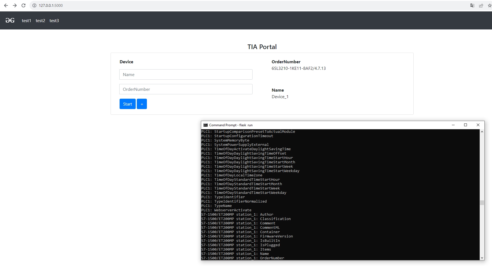

# tiaportal-app

1. Liitä Siemens.Engineering.dll kansioon C:\Program Files\Siemens\Automation\Portal V18\PublicAPI\V18

2. Mene kansioon Flask\app\xml ja kopio tiedostot kansioon C:\export\result

3. Asenna python https://www.python.org/downloads/

3. Klikkaa install.sh

4. Käynnistä sovellus klikkaamalla app.py

