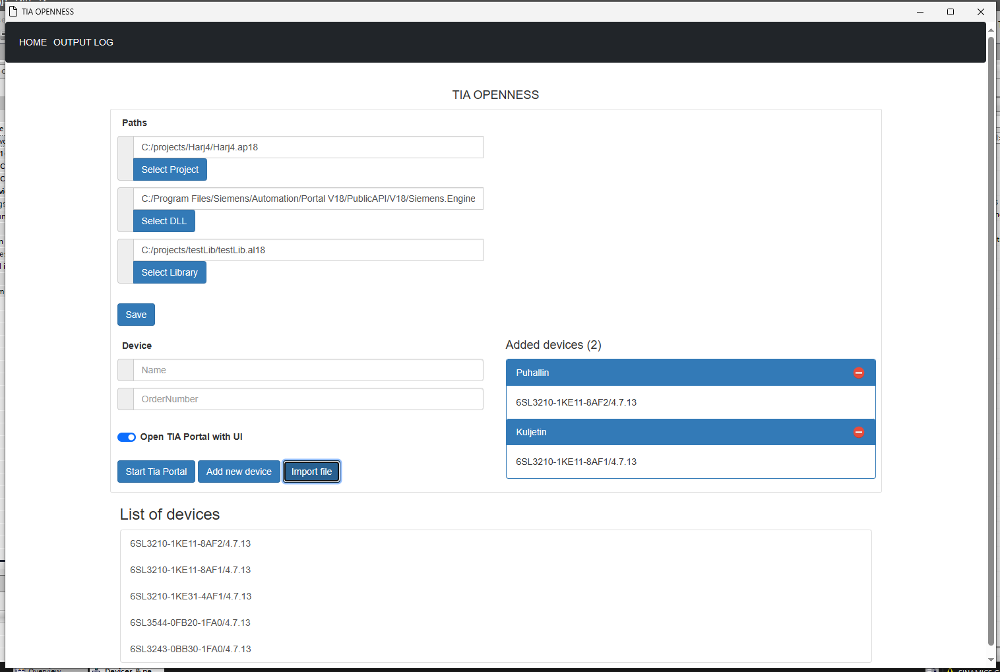

# tiaportal-app

1. Mene kansioon Flask\app\xml ja kopio tiedostot kansioon C:\export\result

2. Asenna python https://www.python.org/downloads/

3. Klikkaa install.sh

4. Käynnistä sovellus klikkaamalla app.pyw

